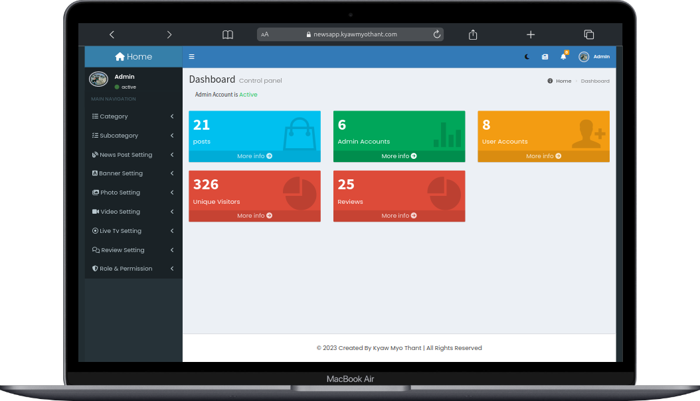
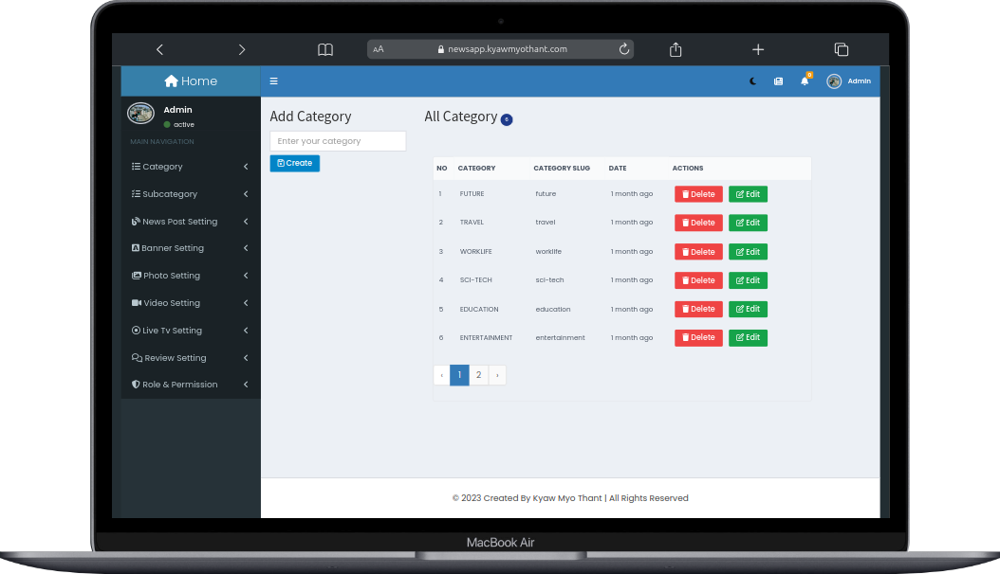
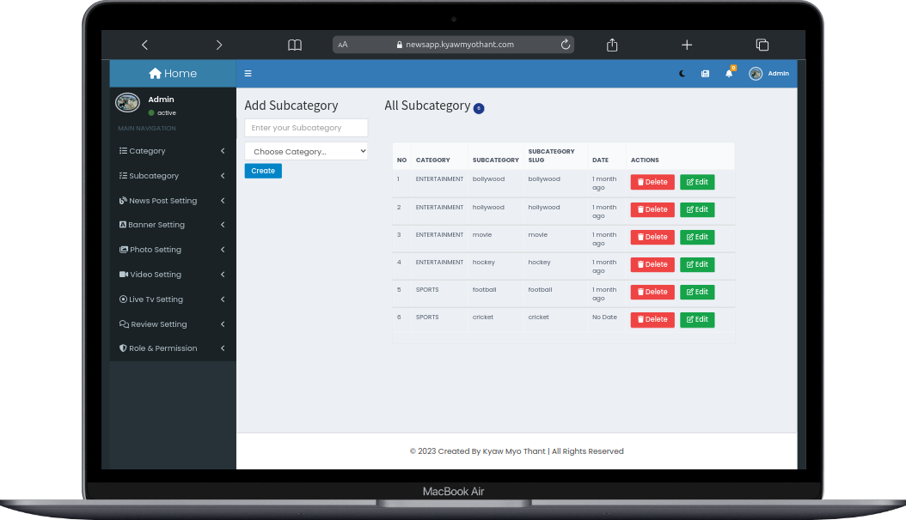
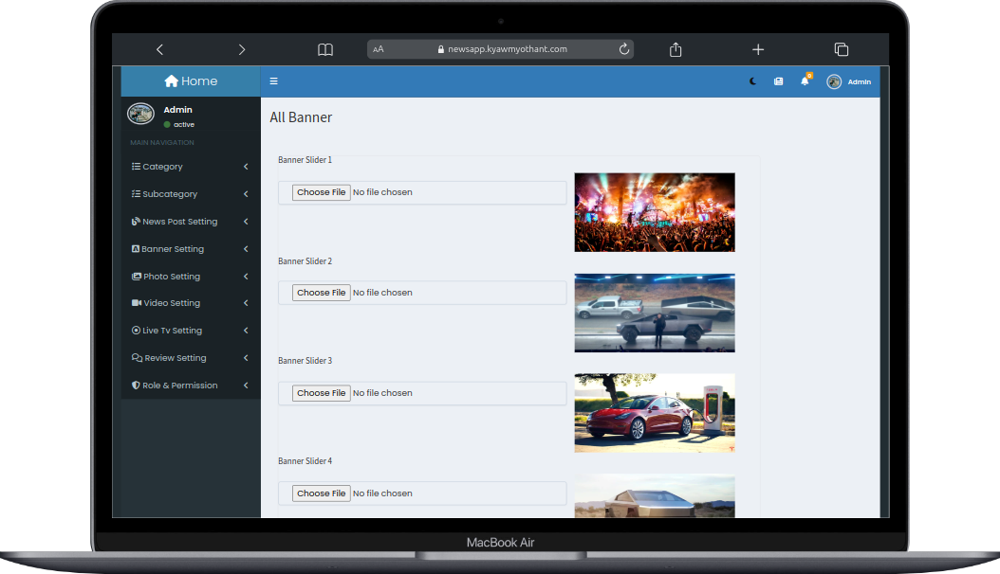
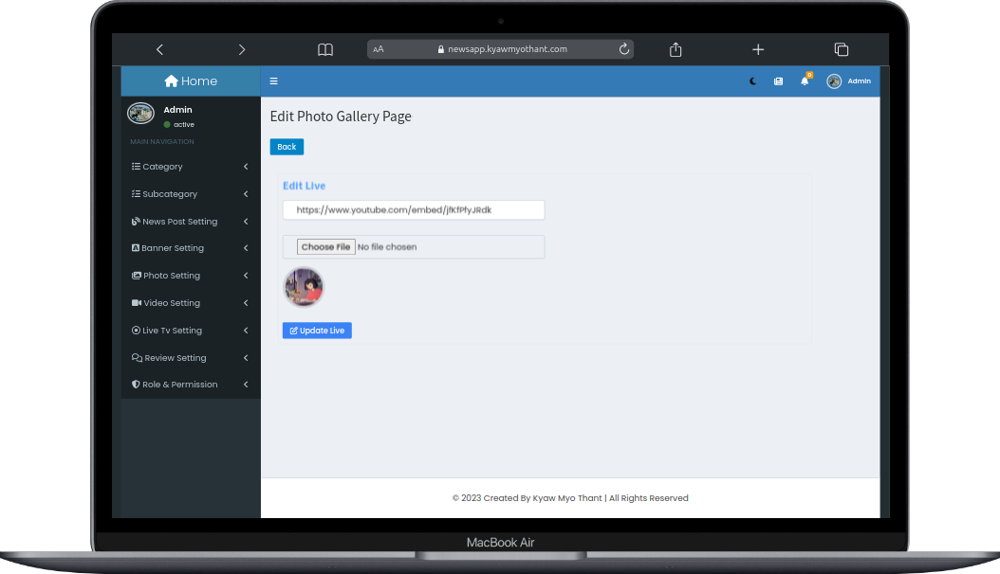
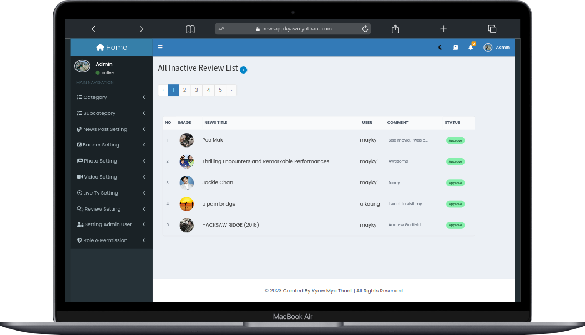
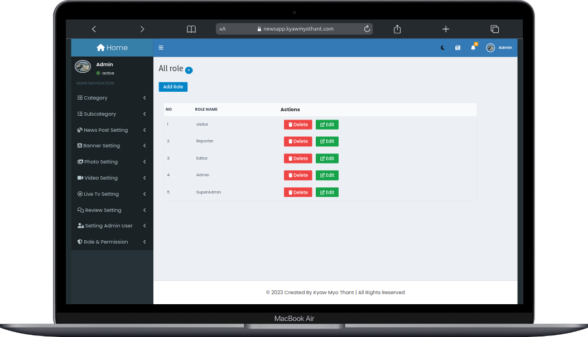
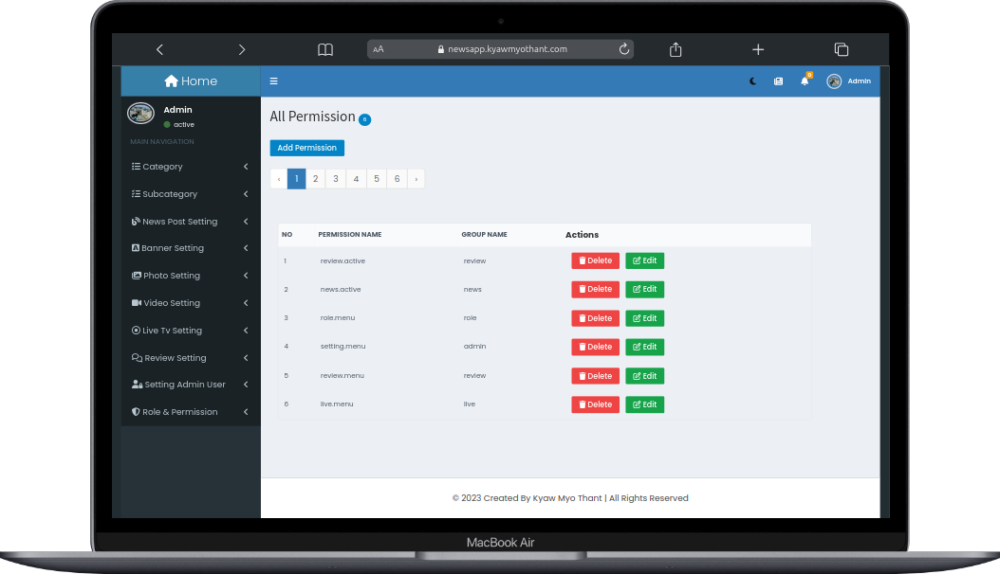

# NewsHub

## Table of Contents
* [General Information](#general-information)
* [Technologies](#technologies)
* [Features](#features)
* [Screenshots](#screenshots)
* [Setup](#setup)
* [Contact](#contact)

## General Information
Welcome to our `NewsHub` website (https://newsapp.kyawmyothant.com/), your ultimate source for comprehensive news coverage. Our platform features a dynamic banner highlighting top stories, categorized sections for easy navigation, constantly updated latest and breaking news, dedicated segments for travel, captivating photo and video galleries, all managed through a robust admin panel with varying user roles. Join us to stay informed and engaged with a diverse range of current events and topics from around the globe.


## Technologies
* laravel 9.52.9
* Javascript
* query 3.6.0
* tailwindcss 3.0
* bootstrap 5.3.0
* CSS3
* Admin Template ( Admin LTE for Backend)


## Features
* Banner
* Categories menu
* Latest news
* Breaking news
* Travel News
* Photo Gallery
* Video Gallery

## Screenshots

### Navbar ,Banner ,Breaking News and Trend news


### Latest News


### Travel News && Photo Gallery


### Video Gallery


## Admin dashboard Setting

### Admin Dashobard Setting


### Category Setting


### Subcategory Setting


### News Post Setting


### Banner Setting


### Photo Gallery Setting


### Video Gallery Setting


### LiveTV Setting


### Review Setting


### Admin List Setting


### All Role Setting


### All Permission Setting


### All Role & Permisson Setting


## Setup
1. Install XAMPP or WAMPP
2. Open XAMPP Control panal and start [apache] and [mysql] .
   ```
   cd C:\xampp\htdocs\
   ```
4. Clone project from github
   ```
    > git clone https://github.com/kaungthant-w/NewsHub.git
   ```
5. Install package dependency
   ```
     cd NewsHub
    > npm install
    > composer install
    > composer update
   ```
6. Set the basic config
   ```
   > cp .env.example .env
   > php artisan key.generate
   ```
   
7. databasename - NewsHub
   ```
   > php artisan storage:link
   > php artisan migrate:fresh --seed
   > php artisan serve
   > npm run dev
   ```
9. Visit  http://127.0.0.1:8000/ in your favorite browser.
10. if you want to access the NewsHub super admin dashboard:
    ```
    email : admin@gmail.com
    password : password
    ```


## Contact
```
Gmail : kyawmyothant.dev@gmail.com
profile website : kyawmyothant.com
phone No : +959977246328
```
